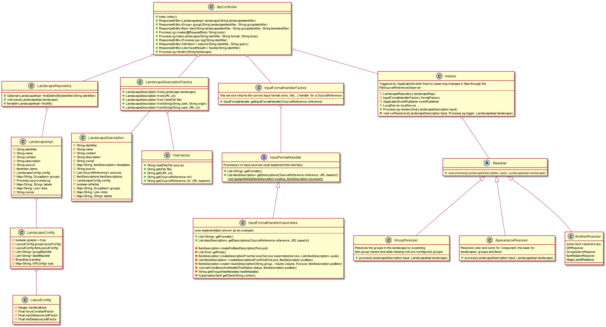

# Getting Started with Nivio Development

**Requirements**

To run nivio you need the following software installed:
- [nodejs v16 LTS](https://nodejs.org/en/), [How to update node?](https://www.hostingadvice.com/how-to/update-node-js-latest-version/)
- [Maven](https://maven.apache.org/install.html)
- Java 17

---

**Docker Setup (Linux)**

Clone nivio, build and run a Docker image:

    git clone https://github.com/dedica-team/nivio.git && cd nivio
    mvn clean package
    docker build -t nivio:latest .
    docker run -e SEED=/tmp/nivio/inout.yml --mount type=bind,source="$(pwd)"/src/test/resources/example,target=/tmp/nivio -p 8080:8080 nivio:latest
    
  then open http://localhost:8080
  
**Docker Setup (Windows)**
 
  Clone nivio, build and run a Docker image:
  
      git clone https://github.com/dedica-team/nivio.git && cd nivio
      mvn clean package
      docker build -t nivio:latest .
      docker run -e SEED=//tmp/nivio/inout.yml --mount type=bind,source="C:\<your>\<path>\<to>\nivio\src\test\resources\example",target=/tmp/nivio -p 8080:8080 nivio:latest
      
   then open http://localhost:8080
   
   (Note: the double slashes at the beginning of the path for the SEED environment variable work as a fix to make MSYS/MinGW consoles
   *not* translate the `/tmp` path to a local DOS path. This is safe to use with the PowerShell. Further reading: https://stackoverflow.com/a/14189687/10000398)
   
   ---
 
**Development Setup (IntelliJ)**
 
 Create a Spring Boot Configuration in IntelliJ that looks like this:
 
  
  
  If you need a clean build you can run 
  
    mvn clean package
  
  You can use your own configuration files, if you add SEED=/path/to/config as an environment variable.
  
  Open http://localhost:8080
  
  If you want to contribute to our frontend, read further into our [Frontend Readme](https://github.com/dedica-team/nivio/tree/develop/src/main/app)
  
**Nivio Backend Architecture**

If you want to contribute to our backend, maybe the following diagram is of use to you. It shows some of the most important classes and 
interfaces. It is supposed to give you an idea on how the backend is structured, but note that not all details are displayed:

 
 
 If you use the `ApiController` as the entry point to the backend, you can see that it retrieves information and triggers events
  to the most important parts of the application. 
 
The `LandscapeRespository` gives access to the stored landscapes.
  
The `LandscapeDescriptionFactory` is used to generate a `LandscapeDescription` from various sources, such as a `String` input, 
or e.g. from a yaml file. 

This `LandscapeDescription` has to be enriched with the `ItemDescription` for all items in the landscape.
This is managed by the `InputFormatHandler`, which are able to read several input formats such as e.g. kubernetes files, or the
nivio description format. Access to these handlers is managed by the `InputFormatHandlerFactory`.

To actually create a landscape, the `Indexer` is used. This is able to compute the landscape graph from a `LandscapeDescription`.
The `Indexer` uses several `Resolver` to resolve groups and item relations in landscapes and e.g. the appearance of the graph.

The `Indexer` can be triggered either directly through the `ApiController` to index or reindex a landscape, or it is triggered
by an observer mechanism on files. These are the files located under the path provided through the `SEED` environment variable.

