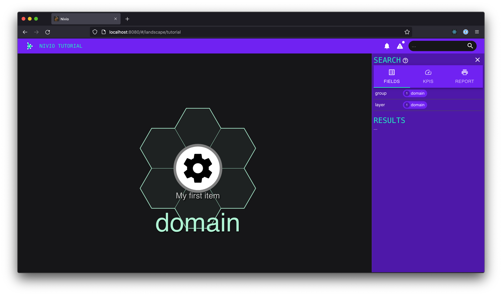
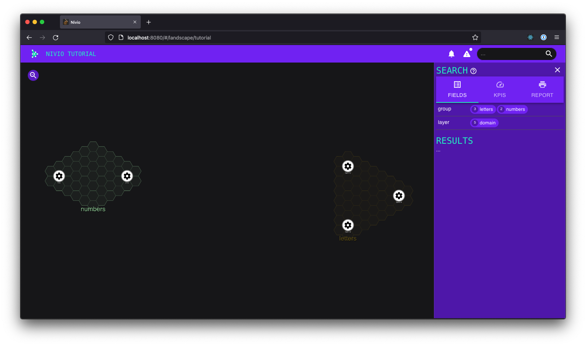
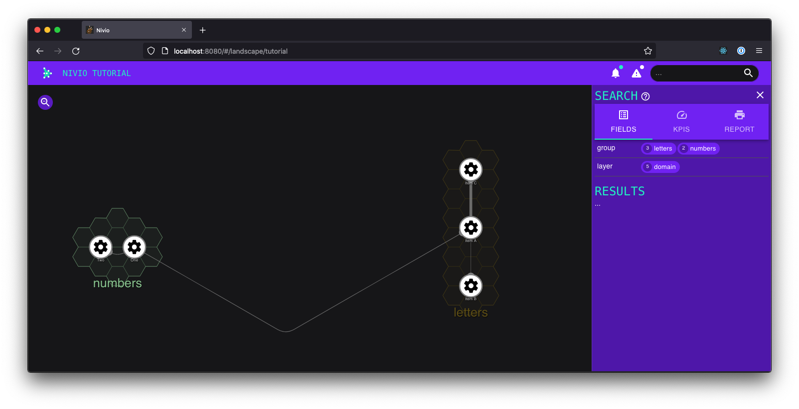

Getting Started
===============

Installation
------------

The easiest way to get started is by bringing up Nivio in Docker:

.. code-block:: bash

   export NIVIO_BASE_URL=http://localhost:8080
   docker run -it --rm -e NIVIO_BASE_URL -p 8080:8080 dedica/nivio:latest

Take a look at http://localhost:8080/

A friendly reminder on the application starting screen tells you that there are no landscapes loaded, yet. To do so, follow the instructions below.

Creating the first landscape
----------------------------

The simplest possible landscape definition consists of:

- an identifier, used e.g. when updating the landscape
- a name, that is shown in the UI
- at least 1 item (things get weird if there are no items at all)

In YAML, it looks like this:

.. code-block:: yaml
   :linenos:

   identifier: tutorial
   name: Nivio Tutorial
   items:
     - identifier: item-1
       name: My first item

Create the file tutorial.yaml and upload (POST) this file using curl:

.. code-block:: bash

   curl -X POST -H "Content-Type: application/yaml" --data-binary @tutorial.yaml ${NIVIO_BASE_URL}/api/landscape

Take another look at http://localhost:8080/

You should find your landscape with the item in it. The item might be assigned to a default group called `domain`.

The OpenAPI (aka Swagger) documentation is located at :file:`/v3/api-docs` (JSON) or :file:`/swagger-ui.html` (HTML GUI).

Updating the landscape
----------------------

For example, simply change the name of the item and run the same curl command again.

The landscape diagram should update immediately in your browser.

Only if you change the name of the landscape itself, then you need to refresh the browser manually.

As long as the landscape's `identifier` is the same, it will be updated in place. If you change the landscape identifier in the YAML file, then Nivio will create a new, separate landscape.

.. code-block:: bash

   curl -X PUT -H "Content-Type: application/yaml" --data-binary @tutorial.yaml ${NIVIO_BASE_URL}/api/landscape/tutorial

If the update doesn't seem to be happening, make sure the curl request didn't fail and you used ``PUT`` as method. If the reason is not obvious, you can also investigate in the Nivio logs.

For some changes, unfortunately though, you will have to restart Nivio and submit the landscape afresh.

Exploring the Nivio model
-------------------------

Adding your own groups
^^^^^^^^^^^^^^^^^^^^^^

- Without groups, all items will be assigned to a default group. Items can be assigned to groups using the ``group`` attribute.
- If a group does not exist, nivio creates it. To customize a group, add it to the configuration.
- However, you can't create a group with no attributes. Nivio will not accept the landscape. So at least add an ``owner``.

.. code-block:: yaml
   :linenos:

   groups:
     letters:
       owner: Myself
       description: All the letters
     numbers:
       owner: Myself
       description: All the numbers
   items:
     - identifier: a
       name: Item A
       group: letters
       ...

Adding relations between items
------------------------------

- Relations are a key element of every graph. Note that relations are directional in Nivio.
- A relation can have a `weight` attribute between 0-5 to control the width of the line between the two items.

.. code-block:: yaml
   :linenos:

  - identifier: a
    name: Item A
    group: letters
    relations:
      - target: b
        weight: 0.5
      - target: c
        weight: 5

Adding icons
------------

.. code-block:: yaml
   :linenos:

    - identifier: a
      name: Item A
      group: letters
      icon: https://visioguy.github.io/IconSets/aws/icons/amazon_ec2.png
    - identifier: b
      name: Item B
      group: letters
      icon: https://visioguy.github.io/IconSets/aws/icons/amazon_dynamodb.png
    - identifier: c
      name: Item C
      group: letters
      icon: https://visioguy.github.io/IconSets/aws/icons/amazon_simple_queue_service_(sqs).png

.. image:: icons.png

Observations
^^^^^^^^^^^^

* We are not using them here, but don't forget that Nivio supports all the [Material Design Icons](https://materialdesignicons.com/) out of the box!
* If you do use custom icons intensively, you should find a place for hosting them. You can define an environment variable :envvar:`NIVIO_ICON_FOLDER` which contains a path reachable for the app.

Introducing KPIs
-----------------

Before you can set a KPI on an item, you need to define the KPI itself.

Here we create one called ``capacity``. It requires a value of ``90-100`` in order to be considered healthy (green),
``80-90`` for semi-healthy (yellow), and everything else will be considered unhealthy (red):

.. code-block:: yaml
   :linenos:

   config:
     kpis:
       capacity:
         label: capacity
         ranges:
           GREEN: 90;100
           YELLOW: 80;90
           RED: 0;80

Now the KPI can be used simply by adding the corresponding attribute to any item:

.. code-block:: yaml
   :linenos:

   items:
     - identifier: a
       name: Item A
       capacity: 87

Observations
^^^^^^^^^^^^

* The status of a KPI (i.e. its color) is automatically assessed based on the attribute value - awesome! 🏆
* There are two other colors that you could use, orange and brown.
* You only need to define a KPI once, then you can use the respective attribute on as many items as you need to. And of course, an item can use multiple KPIs.

Summary
-------

Conclusion
^^^^^^^^^^

Once you have figured out its configuration language, Nivio is a great tool for quickly creating a cool visualization of your graph and of the dependencies between the entities you are managing, whether it's software architecture, an application landscape, your organization, or any other domain. The addition of dynamic KPIs and the status aggregation make it really easy to spot issues quickly!

Best practices
^^^^^^^^^^^^^^

* Use ``groups`` and ``items``. Use ``relations`` between items. They also can have weights.
* A group requires at least 1 attribute in order to work. Use ``owner``, because Nivio always shows something on the owner anyways, and "No owner" doesn't look great.
* The following attributes should be on every item: a ``name``, an ``icon``, a ``group`` assignment, KPI attributes for the info tab, and any ``random word`` with a ``value`` for the details tab. This way, the item's details will be nicely filled out across the info, relations (if applicable), and details tabs.
* Define your own KPIs that make the most sense for your use case.
* Find a place to host your custom icons. Don't abuse and don't rely on external hosts!
* Make sure to read :ref:`Using Templates to dynamically assign data` before putting too much effort into item configuration.

Caveats
^^^^^^^

- The colors that are automatically assigned to groups tend to be dark and lack contrast, because they are also used for printing with white background. While you can assign colors manually, it's very tedious to do so.
- You can experiment a lot with the structure of the landscape, but better figure out the attributes once and then stick to them. For example, icons, or color of groups, etc. - in order to see them updated everywhere (or at all!) you'll often have to restart Nivio and submit the landscape again.

Bonus: Having Nivio pull your data
----------------------------------

In order to have data automatically observed to changes Nivio expects a seed configuration at start time. You need to set the environment
variable :envvar:`SEED`. The configuration file contains basic data, references to item descriptions ``sources``, which can be local paths or URLs.
The descriptions can be gathered by HTTP, i.e. it is possible to fetch files from protected sources via authentication headers.
Think of GitLab or GitHub and the related tokens. To use secrets etc., please refer to :ref:`Environment variables`.

.. code-block:: yaml
   :linenos:

    identifier: nivio:example
    name: Landscape example
    contact: mail@acme.org
    description: This is an example landscape.
    sources:
      - "./items/wordpress.yml"
      - url: "http://some.server/docker-compose.yml"
        format: docker-compose-v2
      - url: https://gitlab.com/bonndan/nivio-private-demo/raw/docker-compose.yml
        headerTokenName: PRIVATE_TOKEN
        headerTokenValue: ${MY_SECRET_TOKEN_ENV_VAR}

Deleting items
--------------

Items not referenced anymore in the descriptions will be deleted automatically on a complete and successful re-index run.
If an error occurs fetching the source while indexing, the behaviour of the indexer changes to treat the available data as
partial input. This means only inserts and updates will happen and no deletion.

Environment variables
---------------------

The following environment variables can be set to configure nivio:

.. include:: inc_env_config.rst
